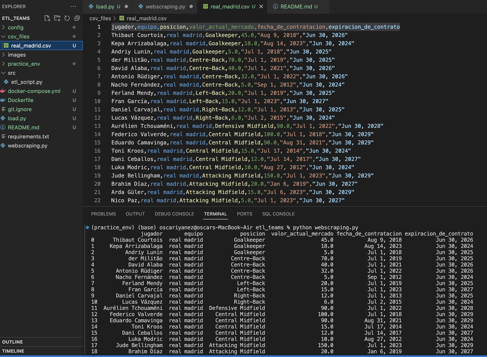
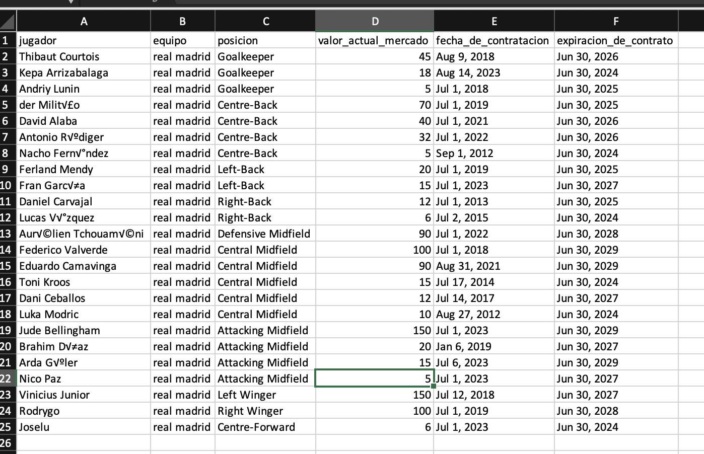
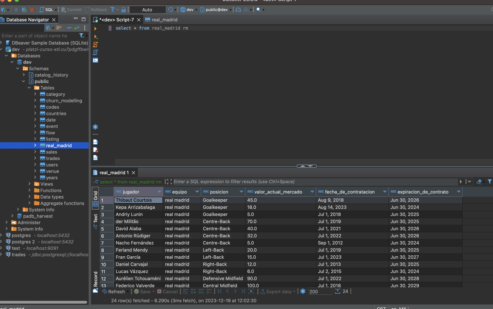

# Game Project 

Para correr el jueguo debes seguir las siguientes instrucciones en la terminal:

# etl_clone
```sh
cd etl_teams
git clone
source practice_env/bin/activate
pip install -r requirements.txt
```

# RUN the webcraping file
```sh
# to run the file and get th data of the madrid team
python webscraping.py  
```


# configuration of s3
```sh

''' to configure s3 
You have to create your global variables. Example into load.py file 
Define your Redshift and S3 credentials

redshift_credentials = {
    'dbname': os.environ.get('REDSHIFT_DATABASE'),
    'user': os.environ.get('REDSHIFT_USER'),
    'password': os.environ.get('REDSHIFT_PASSWORD'),
    'host': os.environ.get('REDSHIFT_HOST'),
    'port': 5439
}
s3_credentials = {
    'aws_access_key_id': os.environ.get('AWS_ACCESS_KEY_ID'),
    'aws_secret_access_key': os.environ.get('AWS_SECRET_ACCESS_KEY'),
}
'''


```
# at the end. you should see something like this below 
```
```
###  Web scraping 


## Excel file 


# postgress data 


```
